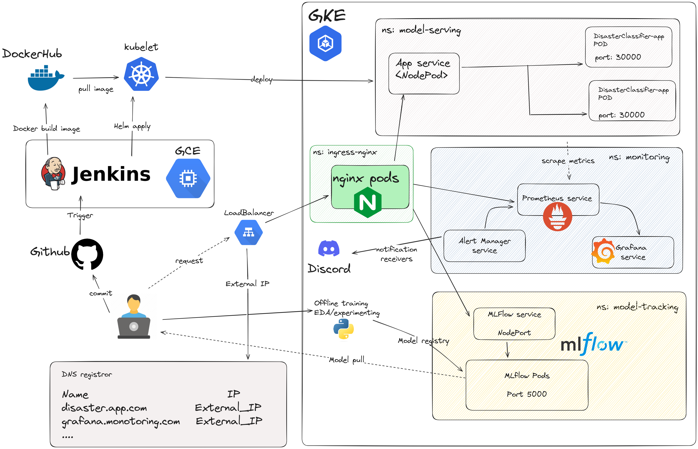

# Natural Language Processing with Disaster Tweets

Over the years, Twitter has become a critical communication tool for responding to natural disasters. 

In this project, the goal is to build Maching learning application that predicts which Tweets are about the real disaster and which ones aren't. Furthemore, I built the a MLOps systems, the objective is to streamline and automate the deployement, monitoring, maintenance ML models in production enviroments. The repository contains a Jupyter notebook, code source for modelling, as well as additional documentation and resources. The source data is mentioned here:

https://www.kaggle.com/competitions/nlp-getting-started

## Table of contents

<!--ts-->
   * [Overal architecture](#overal-architecture)
   * [Project structure](#project-structure)
   * [Getting started](#getting-started)
      * [Prepare enviroment](#prepare-enviroment)
      * [Train model](#train-model)
   * [On-premise deployment](#on-premise-deployment)
      * [Running application docker container in local](#running-application-docker-container-in-local)
      * [API local testing](#api-local-testing)
   * [Cloud migration](#cloud-migration)
     * [Application service deployment in GKE](#application-service-deployment-in-gke)
        * [Create a project in GCP](#create-a-project-in-gcp)
        * [Install gcloud CLI](#install-gcloud-cli)
        * [Install gke-cloud-auth-plugin](#install-gke-cloud-auth-plugin)
        * [Using terraform to create GKE cluster](#using-terraform-to-create-gke-cluster)
            * [Deploy nginx ingress controller](#deploy-nginx-ingress-controller) 
            * [Deploy model serving service](#deploy-model-serving-service)
            * [Deploy model tracking service](#deploy-model-tracking-service) 
            * [Deploy monitoring service](#deploy-monitoring-service)
     * [CI/CD with Jenkins on GCE](#ci/cd-with-jenkins-on-gce)
        * [Create the VM instance](#create-the-vm-instance)
        * [Install Docker and Jenkins on GCE](#install-docker-and-jenkins-on-gce)
        * [Setting Jenkins via GCE](#setting-jenkins-via-gce)
            * [Launch Jenkins instance](#launch-jenkins-instance)
            * [Setup connection Jenkins to github repo](#setup-connection-jenkins-to-github-repo)
            * [Setup connection GKE to Jenkins](#setup-connection-gke-to-jenkins)
        * [Continuous deployment](#continuous-deployment)
   * [Demo](#demo)
         


<!--te-->

## Overal architecture


## Project structure
```bash
├── ansible                      # Ansible configurations for GCE
├── data                         # Storing data files
├── deployment                   # Deployment-related configurations
│   ├── jenkins                  # Jenkins deployment configurations
│   │   ├── build_jenkins_image.sh 
│   │   ├── docker-compose.yaml     
│   │   └── Dockerfile             
│   ├── mlflow                   # MLflow deployment configurations
│   │   ├── build_mlflow_image.sh  
│   │   ├── docker-compose.yaml     
│   │   ├── Dockerfile             
│   │   └── run_env                 # Environment for running MLflow
│   │       └── data                # Data directory for MLflow
│   │           └── mlflow.db       # MLflow SQLite database
│   └── model_predictor          #  App deployment configurations
│       ├── docker-compose.yaml     
│       └── Dockerfile             
├── helm                         # Helm charts for Kubernetes deployments
│   ├── disaster_chart           # Helm chart for app
│   ├── grafana-prometheus       # Helm chart for Grafana and Prometheus 
│   ├── mlflow                   # Helm chart for MLflow deployment
│   └── nginx-ingress            # Helm chart for Nginx Ingress setup
├── Jenkinsfile                  # Jenkins pipeline configuration file
├── main.py                      # app fast api 
├── Makefile                     
├── models                       # Folder for storing trained models
├── notebook                     # EDA
├── README.md                    
├── requirements.txt             # Python package dependencies
├── src                          # Source code directory
├── terraform                    # Terraform configurations for GKE
└── test                         # Folder for storing test scripts
```
## Getting Started

To get started with this project, we will need to do the following

### Prepare enviroment 

Clone the repository to your local machine.

`git clone git@github.com:quochungtran/NLP-with-Disaster-Tweets.git`

Install all dependencies dedicated to the project

```bash
conda create -n NLP-with-Disaster-Tweets python=<python_version>
conda activate NLP-with-Disaster-Tweets
pip install -r requirements.txt
make mlflow_up
```
### Train model

- Process data

```bash
python src/text_preprocessing.py
```

- Train model

```bash
python src/tfv_train.py --pre true --fold <fold number> --model <name_model_from_model_dispatcher>
```

The fold number ranges from 1 to 5, corresponding to the partitions dedicated to testing data, created during k-fold cross-validation for splitting the training data.

- Register model at `http://localhost:5001` to access to MLFLOW UI.

## On-premise deployment

### Running application docker container in local 

- Build and run the Docker image using the following command

```bash
make app_local_up
```

Navigating FastAPI deployement model using `localhost:8080/docs` on host machine


## Cloud migration


Deploying your ML application on-premises imposes various constraints and limitations, hindering scalability, flexibility and security as well. However, migrating your ML application to Google Cloud Platform (GCP) offers a strategic advantage, enabling to leverage scalable infrastructure, advanced analytics, and managed services tailored for machine learning workflows.

### Application service deployment in GKE

To migrate our application service to the cloud using Google Cloud Platform (GCP), we'll start by enabling the Kubernetes Engine API as shown below:


#### Create a project in GCP

First we need to create a project in [GCP](https://console.cloud.google.com/projectcreate?hl=vi&pli=1)

#### Install gcloud CLI
- gclound CLI can be installed in the following document

- Initialize gclound CLI, then type Y

```bash
gcloud init
Y
```
- A pop-up will prompt us  to select your Google account. Select the account associated with your GCP registration and click `Allow`.

- Go back to your terminal, in which you typed `gcloud init`, type 1, and Enter.

- Then type Y, select the GCE zone corresponding to europe-west4-a (in my case), then Enter.


#### Install gke-cloud-auth-plugin

In the next step, we'll install the GKE Cloud Authentication Plugin for the gcloud CLI tool. This plugin facilitates authentication with GKE clusters using the gcloud cli.

We can install the plugin using the following command:

`sudo apt-get install google-cloud-cli-gke-gcloud-auth-plugin`

This command will install the necessary plugin for authenticating with GKE clusters.

#### Using terraform to create GKE cluster

Terraform is a powerful infrastructure as code tool that allows us to define and provision infrastructure in a declarative manner. It helps to facilitate to automate the creation, modification, and deletion of infrastructure resources across various cloud providers.

To provision a GKE cluster using Terraform, follow these steps:

- We should update the invidual project ID, the corresponding GKE zone and its node machine. In my case, a gke cluster will be deployed in zone `europe-west4-a` with its node machine is: 

```bash 
cd terraform
terraform init  # Initialize Terraform in the directory
terraform plan  # Plan the configuration
terraform apply # Apply the configuration to create the GKE cluster
```

- A created cluster will be pop up in GKE UI (after 8 to 10 minutes)


- connect to gke cluster using `gcloud cli`

```bash
gcloud container clusters get-credentials mlops-415023-gke --zone europe-west4-a --project mlops-415023
```
- To view your highlighted cluster ID in the terminal, you can use the `kubectx` command.


##### Deploy nginx ingress controller

An Ingress controller is a specialized load balancer for k8s enviroment, which accept traffic from outside the k8s platform, and load balance it to application containers running inside the platform. 

Deploy Nginx ingress controller in corresponding name space in following commands: 

```bash
cd helm/nginx-ingress    
kubectl create ns nginx-ingress # Create a K8s namespace nginx-ingress
kubens nginx-ingress            # switch the context to the newly created namespace 'nginx-ingress'
helm upgrade --install nginx-ingress-controller . # Deploy nginx Ingress 
```

Verify if the pod running in the specified namespace nginx-ingress
```bash
k get pods -n nginx-ingress
```


##### Deploy model serving service

I decided to deploy the FastAPI application container on GKE within the model-serving namespace. Two replicas will be created, corresponding to the two pods.

```bash
cd helm/disaster_chart
kubectl create ns model-serving
kubens model-serving
helm upgrade --install disaster-text-classifier .
```

- Get IP address of nginx-ingress
```bash
kubectl get ing
```

- Add the domain name `disaster.classify.com` of this IP to `/etc/hosts` where the hostnames are mapped to IP addresses. 

```bash
sudo nano /etc/hosts
[INGRESS_IP_ADDRESS] disaster.classify.com
```

##### Deploy model tracking service

Rather than manually accessing the MLFlow server to keep track of experiments and models in local machine, we can facilitate collaboration by sharing artifacts with stakeholders in other locations. This can be achieved by deploying MLFlow on the cloud within the `model-tracking` namespace.

```bash
cd helm/model_tracking
kubectl create ns model-tracking
kubens model-tracking
helm upgrade --install model-tracking .
```

- Add the domain name `mlflow.classify.com` of this IP to `/etc/hosts` where the hostnames are mapped to IP addresses. 

```bash
sudo nano /etc/hosts
[INGRESS_IP_ADDRESS] mlflow.tracking.com
```

##### Deploy monitoring service

```bash
cd helm/grafana-prometheus/kube-prometheus-stack/
k create ns monitoring
kubens monitoring
helm upgrade --install kube-grafana-prometheus .
```

- Get all the informations all resources in monitoring namespace:

```bash
k get all
```

- Add all the services of this external IP to `/etc/hosts`, including:

```bash
sudo nano /etc/hosts
[INGRESS_IP_ADDRESS]  grafana.monitoring.com
[INGRESS_IP_ADDRESS]  promeutheus.monitoring.com
[INGRESS_IP_ADDRESS]  alertmanager.monitoring.com
```

To get grafana credentails, you could launch the following command to access the enviroment variable from the container, for example:

```bash
k exec kube-grafana-prometheus-d5c9d4696-z6487 -- env | grep ADMIN
```
When I describe the pod, it states the ENV variable will be set from the secret:

```bash
Environment:
    GF_SECURITY_ADMIN_USER:      <set to the key 'admin-user' in secret 'kube-prometheus-stack-grafana'>      Optional: false
    GF_SECURITY_ADMIN_PASSWORD:  <set to the key 'admin-password' in secret 'kube-prometheus-stack-grafana'>  Optional: false
```
### CI/CD with Jenkins on GCE

Now, we would like to set up a CI/CD with Jenkins on Google Compute Engine(GCE), the objective is 
to establish a streamlined and automated process for Continuous Delivery of Machine Learning application.

We use Ansible to define and deploy the infrastructure such as virutal machine to deploy Jenkins on GCE.

#### Create the VM instance

Access to Service accounts and select Compute Admin role (Full control of all Compute Engine resources) for your account.

Generate and download new key as json file. Remind that we need to keeps this file safely. Put your credentials in the folder ansible/secrets, which is used to connect GCE. 

We should update project ID and service_account_file in `ansible/deploy_jenkins/create_compute_instance.yaml`.

- Execute the playbook to create the Compute Engine instance:

```bash
cd ansible/playbook_with_jenkins
ansible-playbook create_compute_instance.yaml
```


#### Install Docker and Jenkins on GCE

Deploy our custom Jenkins (which use custom image from the folder `deployment/jenkins`) in following steps:
- Update the external IP of newly created instance to `inventory` file.

```bash
cd ansible/playbook_with_jenkins
ansible-playbook -i ../inventory deploy_jenkins.yml
```

#### Setting Jenkins via GCE

##### Launch Jenkins instance

- Access to the instance via ssh command in terminal :

```bash
ssh user_name@external_IP
```

- Connect Jenkins UI via browser: `external_IP:8081`


- For unlock Jenkins, copy password from terminal and paste into web browser:

```bash
sudo docker ps # check if the Jenkins container is running 
sudo docker logs jenkins
```


- Type `skip and continue as admin` and `save and Continue`.
So to log in, I use the username `admin` as the the username.

##### Setup connection Jenkins to github repo 

- Add Jenkins url to webhooks in github repo:


- Configure the github credentials for connecting to Jenkins and then integrate additional DockerHub credentials into Jenkins to enable image registration. These credentials are allowed to access in github project.


- Install the Kurbenestes, Docker, DockerPipeline, GCLOUD SDK plugins at `Manage Jenkins/Plugins` then restart jenkins after complete installation

```bash
sudo docker restart jenkins
```

##### Setup connection GKE to Jenkins

Add the cluster certificate key at `Manage Jenkins/Clouds`. Be ensure that `Kurbenestes` plugins has been installed. 

Don't forget to grant permissions to the service account which is trying to connect to our cluster by the following command:

```shell
kubectl create clusterrolebinding model-serving-admin-binding \
  --clusterrole=admin \
  --serviceaccount=modelmesh-serving:default \
  --namespace=modelmesh-serving

kubectl create clusterrolebinding anonymous-admin-binding \
  --clusterrole=admin \
  --user=system:anonymous \
  --namespace=modelmesh-serving
```

#### Continuous deployment

The CI/CD pipleine consist the three stages:
- Test model correctness.
- Building the application image, and register it into DockerHub.
- Deploy the application with latest image from DockerHub to GKE cluster.

An overview of success build pipeline in jenkins:


### Demo 

To explore the Disaster classification API, you can access http://disaster.classify.com/docs. This endpoint provides a comprehensive overview of the API's functionality, allowing you to test its capabilities effortlessly.


For monitoring the resource quotas across namespaces within our Kubernetes cluster, Grafana provides an intuitive interface accessible via grafana.monitoring.com. This dashboard offers insights into resource utilization, including CPU, memory, and more, for each pod within the cluster.


Moreover, we've implemented a custom dashboard in Grafana to monitor specific resource metrics, such as CPU usage, for pods within the `model-serving` namespace. This provides targeted insights into the performance of critical components within our infrastructure.


In addition to infrastructure monitoring, a model tracking service is provided accessibly via http://mlflow.tracking.com:5001. This platform allows us to efficiently manage and track model artifacts, performance metrics, dataset sizes, and other relevant information, providing valuable insights into model inference processes.


#### TODOS

- Add new model/expriments, redesign the code base.
- Apply nginx controller routing to mlflow.
- Add more test case.
